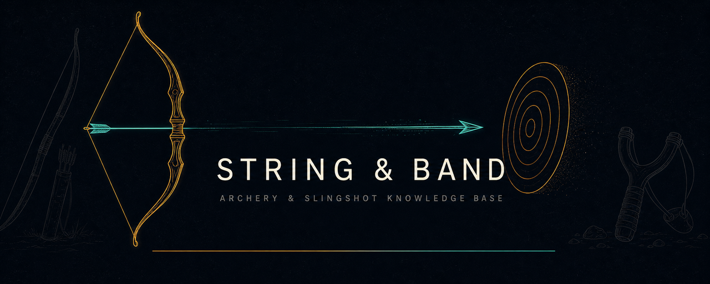

<p align="center">
  
</p>

<h1 align="center">String &amp; Band</h1>

<p align="center">
  <strong>An offline-first educational knowledge base on the history, materials, terminology<br>and craft of archery equipment and slingshots.</strong>
</p>

<p align="center">
  <a href="https://github.com/DLinacre/string-and-band/actions/workflows/ci.yml"></a>
  <a href="LICENSE"></a>
  
  
  
</p>

<p align="center">
  <a href="https://dlinacre.github.io/string-and-band/"><strong>▶ Live demo</strong></a> ·
  <a href="#quick-start">Quick start</a> ·
  <a href="#features">Features</a> ·
  <a href="#testing">Testing</a>
</p>

---

## Why it exists

Archery books tell you *what* happened; materials catalogues tell you *what things are*.
**String & Band** connects the two — a single, beautifully engineered reference where a
medieval war bow, a Korean horn bow and a modern target slingshot can be studied through the
same lens: **stored energy, honestly explained.**

What makes it unusual is the shape of the delivery: the entire product — content, design
system, charts, search engine, analytics-free interactive tools — is **one self-contained
HTML file**. No frameworks, no CDNs, no trackers, no build step. It works double-clicked
from a downloads folder, and it installs as an offline PWA when served.

## Features

### 📚 Library
- **18 long-form articles** — prehistory & archaeology, the war-bow industry, Asian
  composite traditions, kyūdō, modern recurve & compound design, slings and slingshots,
  timber science, string-fibre history, elastomer physics, adhesives & finishes,
  terminology, regional traditions, famous artefacts, modern sport, safety & UK law,
  conservation & CITES.
- **49-term glossary**, cross-linked from every article, with instant filtering.
- **8 bespoke SVG figures** — longbow anatomy, slingshot anatomy and exploded view,
  growth-ring cross-section, composite laminate stack, energy curves, care cycle and more.

### 🧪 Material explorer
Tick any of **44 materials** across 11 families (timbers, natural fibres, synthetic cords,
adhesives, leather, fabrics, finishes, metals, elastomers, composites, horn/bone/feathers)
and a rules engine writes a live, plain-English analysis:

- what the selection is commonly used for, with role explanations
- averaged property radar and the extremes (strongest, most flexible, least weatherproof…)
- durability ranking, maintenance tiers and per-material care notes
- honest trade-offs, plus **detected historical synergies** — select yew + linen + hide glue
  and it recognises the *Mary Rose* system
- gap suggestions and considered alternatives

> The explorer explains roles, properties and care — it deliberately **excludes
> construction instructions**.

### ⚖️ Comparison lab
Overlay up to four materials on one radar chart, with a full scored table (strength,
flexibility, lightness, weather resistance, longevity, sustainability, availability),
cost tiers, heft and maintenance — plus an auto-written verdict on the biggest gaps.

### 🔍 Search, navigation, personalisation
- **Fuzzy instant search** over articles, materials and glossary terms
- **Command palette** (`Ctrl`+`K`) with actions, recents and favourites
- **Keyboard shortcuts** throughout — press `?` in-app for the full list
- Favourites, recently viewed, explorer selections and comparison sets — all stored
  **locally on your device**, nothing leaves the browser
- Command-style deep links (`#/article/safety`, `#/material/yew`, `#/compare`) for easy sharing

### ♿ Accessibility & quality
- WCAG 2.2 AA targets: semantic landmarks, skip link, ARIA roles and live regions,
  visible focus management across a fully keyboard-operable SPA
- **High-contrast theme**, three-step font scaling, and a reduced-motion mode that
  also respects the OS setting
- Full **print stylesheet** — collapsibles auto-expand, chrome hides, inks to white
- Mobile-first responsive design, dark glass aesthetic, loading skeletons, toasts,
  command palette, floating actions

### 🛠 Engineering
- **One HTML file**: HTML5 + modern CSS (custom properties, grid, `clamp()`, container-aware
  layout) + dependency-free ES2025 JavaScript
- Hand-rolled SVG radar/meter charts — no charting library
- Data-driven: articles, materials, glossary and synergies live as pure data; views render on demand
- Lazy view rendering, passive listeners, debounced inputs, `IntersectionObserver` TOCs
- **PWA**: service worker (cache-first app shell) + web manifest → installable & offline
- ~216 KB total; the entire app is smaller than one hero image on most sites

## Quick start

**Option A — just open it.** Download `index.html` and double-click it. Everything works over `file://`.

**Option B — serve it (enables the PWA/offline install):**

```bash
git clone https://github.com/DLinacre/string-and-band.git
cd string-and-band
python3 -m http.server 8080        # or: npx serve .
# open http://localhost:8080
```

Host it anywhere static — no build, no server logic, no environment variables.
It is currently deployed via GitHub Pages: **https://dlinacre.github.io/string-and-band/**

## App map

| Route | What it is |
|---|---|
| `#/` | Landing — hero, statistics, learning paths, recents & favourites |
| `#/library` | All 18 articles with topic filters |
| `#/article/:id` | Reader view with TOC scroll-spy, print and prev/next |
| `#/materials` | Material explorer + live analysis |
| `#/material/:id` | Full profile of one material (radar, care, partners, alternatives) |
| `#/compare` | Comparison lab |
| `#/glossary` | Filterable terminology reference |
| `#/search` | Instant fuzzy search |
| `#/favourites` | Your pinned shelf (per device) |

### Keyboard shortcuts

| Keys | Action |
|---|---|
| `Ctrl`/`⌘`+`K` or `/` | Command palette / search |
| `g` then `h` `l` `m` `c` `y` `f` | Go to Home / Library / Materials / Compare / Glossary / Favourites |
| `f` | Favourite current page |
| `c` | Toggle high contrast · `+` / `−` text size · `p` print |
| `?` | Shortcuts overlay · `Esc` closes any dialog |

## Testing

There is no runtime dependency tree, so the test suite is intentionally precise and fast —
a Node smoke harness (no npm install needed) that exercises the real application script
against a stub DOM:

```bash
node test/smoke.js     # → ALL CHECKS PASSED (34 assertions)
```

It verifies data integrity for all 44 materials (id uniqueness, score ranges, link
resolution), all 18 articles, glossary size, internal cross-link resolution, icon
references, **every renderer**, the analysis engine, the fuzzy search, and chart
generation. The same checks run on every push in
[CI](.github/workflows/ci.yml).

## Disclaimer

String & Band is an **educational reference**, not a set of construction instructions.
Bows and slingshots store and release real energy: follow the in-app safety article,
respect backstops and eye protection, and check the law where you live
(UK guidance is included and kept general — it is not legal advice).

## Contributing

Issues and PRs are welcome — corrections with sources, additional materials (score them
1–10 on the seven axes and wire in combos/alternatives), new articles, translations or
accessibility improvements. Please run `node test/smoke.js` before submitting.

## License

Code is released under the [MIT License](LICENSE). Article content © David Linacre;
educational quotations of public-domain sources are attributed in-app.

---

<p align="center">
  <sub>Hand-built with vanilla HTML, CSS and JavaScript · zero dependencies · works offline · no trackers</sub>
</p>
